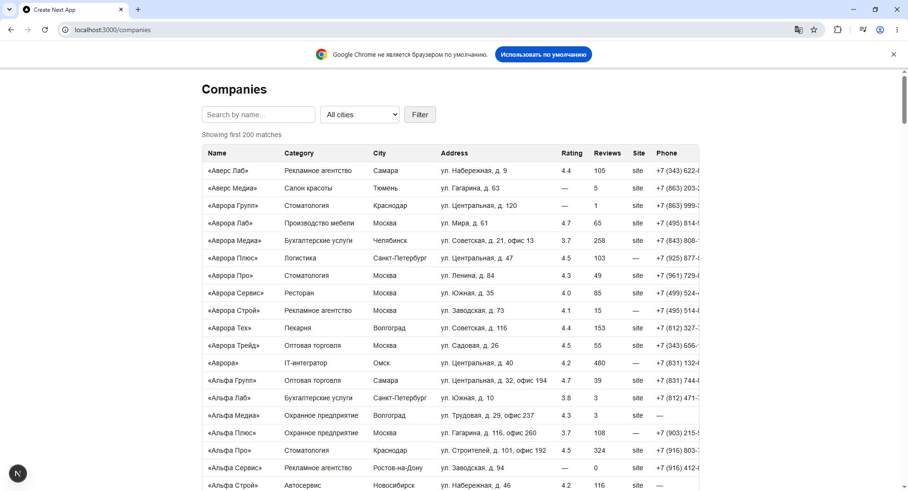
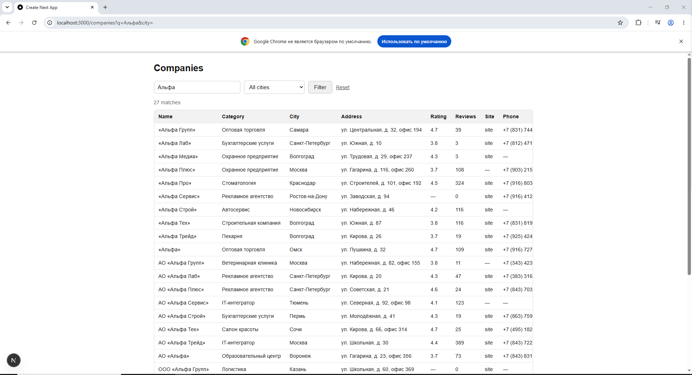
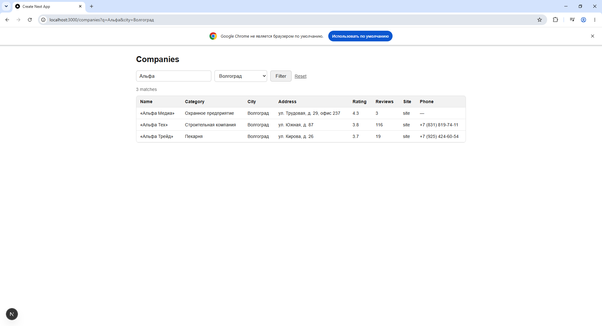

# Polza — тестовое задание: справочник компаний

Справочник компаний на Postgres, загруженный из выгрузки внутреннего API, плюс небольшая страница на
Next.js для поиска/просмотра.

- **Задача 1** — загрузить `data_pack/page_*.json` (~1000 записей) в Postgres.
- **Задача 2** — `/companies`: таблица с серверным рендерингом, поиском по названию и фильтром по
  городу.
- **Задача 3** — загрузить `data_pack/review.csv` (та же схема, но гораздо грязнее) и разобраться,
  что с ним не так. См. [ANOMALIES.md](./ANOMALIES.md).

## Стек

Next.js 16 (App Router, TypeScript), PostgreSQL, `pg` для доступа к БД, `tsx` для запуска
загрузочных скриптов напрямую.

## Установка и запуск

```bash
# 1. Поднять Postgres
docker compose up -d

# 2. Установить зависимости
npm install

# 3. Настроить строку подключения
cp .env.example .env
# .env.example уже соответствует сервису из docker-compose (postgres/postgres@localhost:5432/companies)

# 4. Создать схему
psql "$DATABASE_URL" -f db/schema.sql
# (на Windows, если psql не в PATH: docker compose exec -T db psql -U postgres -d companies -f - < db/schema.sql)

# 5. Загрузить данные
npm run db:load-companies   # data_pack/page_*.json -> companies (994 уникальные записи)
npm run db:load-reviews     # data_pack/review.csv -> companies (см. ANOMALIES.md)

# 6. Выполнить аналитические запросы
psql "$DATABASE_URL" -f db/queries.sql

# 7. Запустить веб-приложение
npm run dev
# открыть http://localhost:3000/companies
```

## Задача 1 — схема и загрузка

`db/schema.sql` описывает одну таблицу `companies`:

- `id` (text, primary key) — natural id из источника (`c_000123`), используется как ключ для
  дедупликации.
- `rating` — `NUMERIC(2,1)` с `CHECK (rating BETWEEN 0 AND 5)`.
- `reviews_count` — `INTEGER NOT NULL DEFAULT 0`, `CHECK (reviews_count >= 0)`.
- Индексы на `category` и `city` (используются агрегирующими запросами и фильтром на `/companies`),
  плюс GIN-индекс `pg_trgm` на `name`, чтобы поиск `ILIKE '%term%'` на `/companies` не превращался в
  полный скан таблицы.

`scripts/load-companies.ts` читает все `page_*.json`, схлопывает дублирующиеся id (в источнике
оказалось 6 точных дублей — один и тот же id, идентичные поля, разбросаны по разным страницам —
1000 сырых записей → 994 уникальные компании) и делает `INSERT ... ON CONFLICT (id) DO UPDATE`, так
что повторный запуск скрипта всегда безопасен.

В `db/queries.sql` — три требуемых запроса: топ-5 категорий по числу компаний, средний рейтинг по
городам (только компании с 10+ отзывами), доля компаний с сайтом по категориям.

## Задача 2 — `/companies`

`app/companies/page.tsx` — серверный компонент (Server Component). Он читает `?q=` и `?city=` из
URL, выполняет параметризованный запрос напрямую к Postgres (без клиентского фетчинга, без
отдельного API route) и рендерит результат таблицей. Список городов для выпадающего списка берётся
через `SELECT DISTINCT city`. Фильтры — обычная `<form method="get">`, поэтому состояние
поиска/фильтра целиком живёт в URL и работает без JavaScript.

### Скриншоты

Вид по умолчанию (компании из Postgres, без фильтров, до 200 строк):



Поиск по названию (`Альфа` — 27 совпадений, `?q=Альфа` в URL):



Поиск + фильтр по городу вместе (`Альфа`, сужено до `Волгоград` — 3 совпадения):



### Как проверял

Прогнал загрузчик на реальном локальном Postgres, затем открыл `/companies` в настоящем браузере
(Chrome) и потыкал руками: вид без фильтров, ввод названия в поле поиска и нажатие Filter, затем
добавление города поверх того же поиска — чтобы проверить, что два фильтра комбинируются через AND, а
не один перебивает другой. Также проверял URL после каждого шага (`?q=...&city=...`), чтобы
убедиться, что состояние фильтров действительно живёт в query-строке, а не в каком-то клиентском
state, который сбросился бы при обновлении страницы. До этого я тестировал те же query-строки через
`curl` и поймал настоящий баг: кириллические названия городов, переданные через
`curl --data-urlencode` в Git Bash, ломались по кодировке ещё до отправки запроса, из-за чего
`/companies?city=Сочи` возвращал `0 matches` для города, где компании точно есть — оказалось, что это
проблема кодировки в shell/терминале, а не баг в приложении; подтвердил это, посмотрев, какой именно
запрос реально дошёл до Next.js (там были символы-заменители вместо кириллицы). После этого перешёл
на тестирование через адресную строку настоящего браузера — именно оттуда сделаны скриншоты выше.

## Задача 3 — review.csv

`npm run db:load-reviews` парсит `review.csv`, валидирует/нормализует каждое поле и печатает отчёт о
том, что именно было исправлено, отброшено или помечено. Полный разбор того, что не так с файлом — и
как каждая проблема была обнаружена — в [ANOMALIES.md](./ANOMALIES.md). Коротко: это на самом деле не
"отзывы" (та же схема компаний, никакого содержимого отзывов), есть некорректные значения
rating/reviews_count/phone, один город записан "мойибейком" из-за неправильной кодировки, одна строка
с пропущенной колонкой, из-за которой сдвинулись все значения после неё, и 6 записей в подозрительном,
не пересекающемся с остальными диапазоне id.

## Структура репозитория

```
db/schema.sql        — таблица + индексы + constraints
db/queries.sql        — 3 требуемых аналитических запроса
scripts/load-companies.ts  — загружает page_*.json
scripts/load-reviews.ts    — загружает review.csv, с валидацией/отчётом
scripts/db.ts              — общий pg pool + upsert-хелпер для скриптов выше
lib/db.ts                  — pg pool для Next.js-приложения
app/companies/page.tsx     — роут /companies
data_pack/                 — исходные данные из задания (JSON-страницы + review.csv)
ANOMALIES.md                — разбор задачи 3
docs/screenshots/           — доказательства для задачи 2
```
